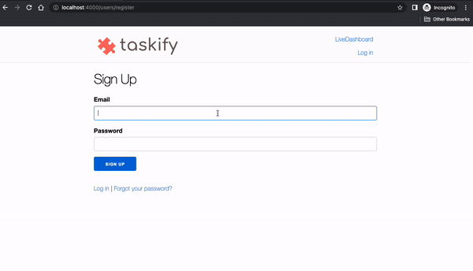
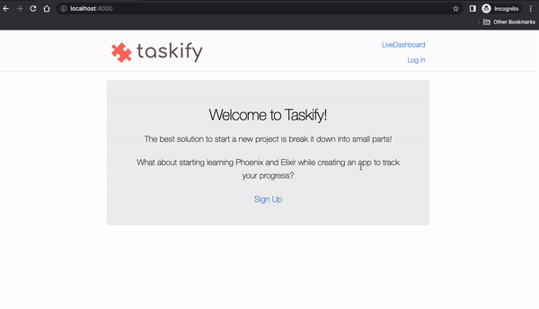

Taskify is a toy app created for the "Getting Started with Phoenix" workshop.
The goal is to introduce the basic structure of a [CRUD](https://en.wikipedia.org/wiki/Create,_read,_update_and_delete) web app using the [Phoenix Framework](https://phoenixframework.org/).

Estimated workshop duration: 2 hours

## Tracking tasks with Taskify

The best solution to start a new project is to break it down into small parts!
What about starting learning Phoenix and Elixir while creating an app to track your progress?

### Recommended setup

* Elixir 1.14.1
* Erlang  24.3.4.6
* Phoenix 1.6.15
* PostgreSQL 14.5

Suggestion: use [asdf](https://asdf-vm.com/guide/getting-started.html) with [elixir](https://github.com/asdf-vm/asdf-elixir) and [erlang](https://github.com/asdf-vm/asdf-erlang) plugins

### Task 001 - Creating your own taskify web app

* Run `mix phx.new taskify`
* Install dependencies with `mix deps.get`
* Create and migrate your database with `mix ecto.setup`
* Start Phoenix endpoint with `mix phx.server` or inside IEx with `iex -S mix phx.server`
* Now you can visit [`localhost:4000`](http://localhost:4000) from your browser.


### Task 002 - Building our landing page

The initial version of the new page will be available on:
<http://localhost:4000/welcome>

* Add new route: `/welcome`
* Add new controller: `WelcomeController`
* Add new view: `WelcomeView`
* Add new template: `welcome/index.html.heex`
* Updating `layout/root.html.heex`: Replacing logo image and link on the header page
* Updating page title

Now let's make our new landing page available on: <http://localhost:4000/>

* Set WelcomeControler#index as the root path

And finally, cleaning up dead code and warnings

* Remove dead code
* Fix gettext warning


### Task 003 - Adding an Authentication System

The [`mix phx.gen.auth`](https://hexdocs.pm/phoenix/mix_phx_gen_auth.html) command generates a flexible, pre-built authentication system into your Phoenix app.

To add it to your system, you can run the following command:

```bash
mix phx.gen.auth Accounts User users
```

In which:

* `Accounts` is the Phoenix context to wrap the `User` Module
* `User` is the Elixir module that will contain the Ecto schema for `users` table schema and other validations
* `users` is the name of database table to be created

It will generate a lot of files, including tests.
Continue to follow the instructions from the terminal.

Run he following command to re-fetch your dependencies:

```bash
mix deps.get
```

This command will fetch the new elixir dependency, added by the `mix phx.gen.auth` command. You will see a change on the `mix.lock` file.

Run the migrations, created for the authentication system:

```bash
mix ecto.migrate
```

Now your local database (`taskify_dev`) will have two new tables: `users` and `users_tokens`

```
19:08:39.931 [info] == Running 20221107215733 Taskify.Repo.Migrations.CreateUsersAuthTables.change/0 forward

19:08:39.934 [info] execute "CREATE EXTENSION IF NOT EXISTS citext"

19:08:39.983 [info] create table users

19:08:39.990 [info] create index users_email_index

19:08:39.991 [info] create table users_tokens

19:08:39.997 [info] create index users_tokens_user_id_index

19:08:39.998 [info] create index users_tokens_context_token_index

19:08:40.000 [info] == Migrated 20221107215733 in 0.0s
```

You can access the database with:

```
psql -d taskify_dev
```

Run `\dt` to see all tables in your database.

Now you have an authenticated system for your app 🎉


You can access the mailbox for development environment in: <http://localhost:4000/dev/mailbox>


Now your app knows when a user is logged or not!
Let's update our landing page to make the `Sign Up` flow more visible!

Update landing page to show `Sign Up` link along with the Welcome message.
Show the Sign Up message only for anonymous with assigns!

```elixir
<%= unless @current_user do %>
  <p><%= link "Sign Up", to: Routes.user_registration_path(@conn, :new) %></p>
<% end %>
```

More about `HEEx` (HTML + EEx) - Phoenix template language:
<https://hexdocs.pm/phoenix_live_view/assigns-eex.html>


Additional links about authentication, including sending emails:

* <https://www.literatelabs.com/p/how-to-get-verification-emails-for>
* <https://experimentingwithcode.com/phoenix-authentication-with-phx-gen-auth-part-1/>
* <https://experimentingwithcode.com/phoenix-authentication-with-phx-gen-auth-part-2/>
* <https://github.com/thoughtbot/bamboo>

---

### Task 004 - Creating a list of user tasks

**Using phoenix generator for HTML resources**

Let’s build the core business of our app: the Tasks!
We need to allow the users to
[create/read/update/delete](https://en.wikipedia.org/wiki/Create,_read,_update_and_delete) their tasks!

* Each task will have a name to identify each task, an optional description and a user associated with it.
* A user may have 0-N tasks.
* A task belongs only to a user.

In a [relational model](https://en.wikipedia.org/wiki/Relational_model), it means the tasks table will have a field with a reference (foreign key) for a user from users table

To define the database schema for our tasks and to create a context module that wraps up Ecto access for creating, updating, and deleting tasks, along with web files like controllers and templates for the web interface into our context, let’s use a phoenix generator for HTML resources.

Run:

```
mix phx.gen.html Tasks Task tasks name:string description:text user_id:references:users
```

In which:

* `mix phx.gen.html` is the mix task that generates controller, views, and context for an HTML resource

* `Tasks` is the Phoenix Context to encapsulate the data access and data validation for Tasks; the suggestion from the docs is to use the plural form of the resource when we don’t have a clear context name

* `Tasks.Task` defines the Elixir struct name (in this case, an Ecto schema), allowing casting and validating the task aattributes before saving/updating/deleting.

* `tasks` is the database table name (on PostgreSQL for our current setup) to store our task aattributes

* `name:string description:text` is the list of fields along with their data type

* `user_id:references:users` defines the field name for the reference to the users table; in this case, it will be an attribute named `user_id` on the tasks table

Important: after running the phoenix generator, it will suggest to add a new resource on the `lib/taskify_web/router.ex` file and then, to run `mix ecto.migrate`. **Do not run it yet!**

Ok, need to revert? Run: `mix ecto.rollback`

We need to make a few tweaks to the generated migration in
`priv/repo/migrations/*_create_tasks.exs` (See next section)

Note: in the daily work, the first version of the tasks migration and its adjustments should be a unique
commit; they are separated only for the discussions in the "Getting started with Phoenix" workshop.

If we run the generated migration without reviewing it, this would be the schema for tasks table:

```
taskify_dev=# \d tasks;
                                          Table "public.tasks"
   Column    |              Type              | Collation | Nullable |              Default
-------------+--------------------------------+-----------+----------+-----------------------------------
 id          | bigint                         |           | not null | nextval('tasks_id_seq'::regclass)
 name        | character varying(255)         |           |          |
 description | text                           |           |          |
 user_id     | bigint                         |           |          |
 inserted_at | timestamp(0) without time zone |           | not null |
 updated_at  | timestamp(0) without time zone |           | not null |
Indexes:
    "tasks_pkey" PRIMARY KEY, btree (id)
    "tasks_user_id_index" btree (user_id)
Foreign-key constraints:
    "tasks_user_id_fkey" FOREIGN KEY (user_id) REFERENCES users(id)

```

> 🎯 Do you see any potential issues?



```
~/dev $ psql -d taskify_dev
psql (14.5 (Homebrew))
Type "help" for help.

taskify_dev=# table tasks;
 id |    name    |      description       | user_id |     inserted_at     |     updated_at
----+------------+------------------------+---------+---------------------+---------------------
  1 | Ana's task | Ana's task description |         | 2022-11-09 04:39:18 | 2022-11-09 04:39:18
(1 row)

taskify_dev=#
```

* The created task is not associated with a user
* All routes for tasks are public
* A user A can update a task from a user B

> 💡 A suggestion: Add schema constraints to the database level

The task name is a required field for our business rules, defining it as `null: false` can prevents unintended changes as creating a task without name directly via a SQL editor, for instance

A task without an associated user will not have any special usage for our system, because of it, we set as a require field with `null: false`.

Also, if a user is delete, we can delete all related tasks to the deleted users, reinforce data consistency and data integrity in relational databases

```
Generated database schema

                                          Table "public.tasks"
    Column    |              Type              | Collation | Nullable |              Default
-------------+--------------------------------+-----------+----------+-----------------------------------
  id          | bigint                         |           | not null | nextval('tasks_id_seq'::regclass)
  name        | character varying(255)         |           | not null |
  description | text                           |           |          |
  user_id     | bigint                         |           | not null |
  inserted_at | timestamp(0) without time zone |           | not null |
  updated_at  | timestamp(0) without time zone |           | not null |
Indexes:
    "tasks_pkey" PRIMARY KEY, btree (id)
    "tasks_user_id_index" btree (user_id)
Foreign-key constraints:
    "tasks_user_id_fkey" FOREIGN KEY (user_id) REFERENCES users(id) ON DELETE CASCADE
```

Add `resources "/tasks", TaskController` to router

To see all routes available for your application, run:
`mix phx.routes`

It will show the new routes created for tasks, the controller and action associated to HTTP verb + application path

    ```
    task_path  GET     /tasks                                 TaskifyWeb.TaskController :index
    task_path  GET     /tasks/:id/edit                        TaskifyWeb.TaskController :edit
    task_path  GET     /tasks/new                             TaskifyWeb.TaskController :new
    task_path  GET     /tasks/:id                             TaskifyWeb.TaskController :show
    task_path  POST    /tasks                                 TaskifyWeb.TaskController :create
    task_path  PATCH   /tasks/:id                             TaskifyWeb.TaskController :update
               PUT     /tasks/:id                             TaskifyWeb.TaskController :update
    task_path  DELETE  /tasks/:id                             TaskifyWeb.TaskController :delete
    ```

💡 Allow only authenticated users to access the `/tasks` resource

The `:require_authenticated_user` was created by `mix phx.gen.auth`

See more about routing and pipeline:
<https://hexdocs.pm/phoenix/routing.html>

The previous commit allowed the access to `http://localhost:4000/tasks`
for all requests, anonymous or logged users

Adding the `/tasks` resource into the `:require_authenticated_user`
pipeline allow access to tasks path only for logged users

💡 Allowing the creation of a task associating with the logged user, fixing the other Task data operations. Don't forget to run the test suite:  `mix test`

💡 Making the task description optional

We can also adding a link for Listing Tasks when user is logged

```elixir
<%= if @current_user do %>
  <p><%= link "Listing Tasks", to: Routes.task_path(@conn, :index) %></p>
<% else %>
  <p><%= link "Sign Up", to: Routes.user_registration_path(@conn, :new) %></p>
<% end %>
```



**Additional links:**

About Phoenix Contexts

In Phoenix, contexts often encapsulate data access and data validation. Overall, think of them as boundaries to decouple and isolate parts of your application.

* <https://hexdocs.pm/phoenix/contexts.html>

About the context generators:

Using the context generators is a great way for beginners
and intermediate Elixir programmers alike to get up and running quickly while thoughtfully designing their applications.

* <https://hexdocs.pm/phoenix/Mix.Tasks.Phx.Gen.Html.html>

About Ecto

* <https://hexdocs.pm/ecto/Ecto.html>
* <https://dashbit.co/ebooks/the-little-ecto-cookbook>

About Ecto migrations

* <https://fly.io/phoenix-files/safe-ecto-migrations/>
* <https://github.com/ankane/strong_migrations>

About how to get the current_user in the controller actions:

* <https://remote.com/blog/current-user-in-elixir-phoenix>
* <https://pragprog.com/titles/phoenix14/programming-phoenix-1-4/>

### Task 005 - Creating sub-tasks for a task

* Run generator

```
  mix phx.gen.html SubTasks SubTask sub_tasks name:string description:text completed:boolean task_id:references:tasks
```

* Route + Ensure authentication

```
  resources "/tasks", TaskController do
    resources "/sub_tasks", SubTaskController
  end
```

* Adjusting migration and database schema

* Replacing `sub_task_path` with `task_sub_task_path`. It is still broken as we need to pass a 3rd argument for nested paths

* Go to a path such as <http://localhost:4000/tasks/3/sub_tasks>
`

## Troubleshooting

Compilation errors? Try to run:

```
mix deps.get --clean
```

Still having issues? Delete the `_build` folder to force the compilation

```
rm -rf _build
```

And then, run the server again:

```
mix deps.get
mix phx.server
```

Would you like to run your test suite?

```
mix test
```

Having issues with database used for test?

```
MIX_ENV=test mix ecto.reset
mix test
```
