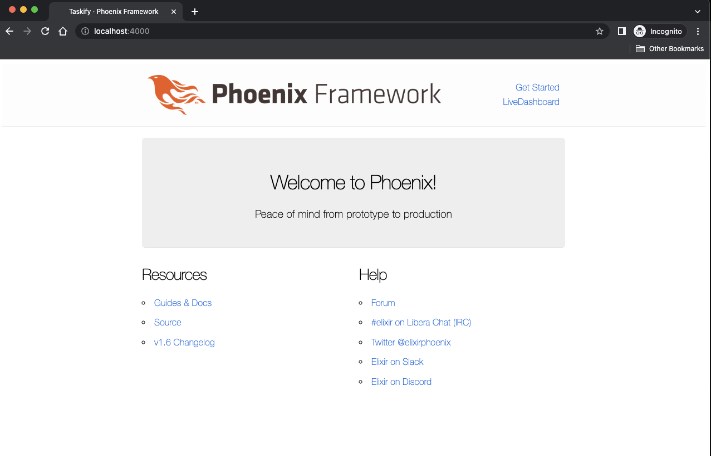
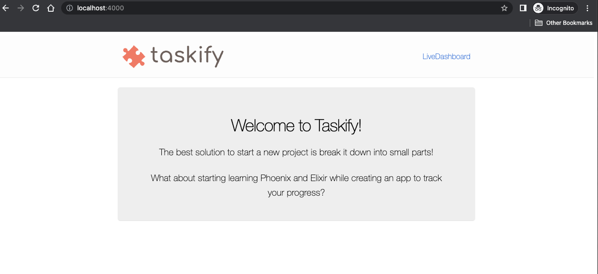

Taskify is a toy app created for the "Getting Started with Phoenix" workshop.
The goal is to introduce the basic structure of a [CRUD](https://en.wikipedia.org/wiki/Create,_read,_update_and_delete) web app using the [Phoenix Framework](https://phoenixframework.org/).

Estimated workshop duration: 2 hours

## Tracking tasks with Taskify

The best solution to start a new project is to break it down into small parts!
What about starting learning Phoenix and Elixir while creating an app to track your progress?

### Recommended setup

* Elixir 1.14.1
* Erlang  24.3.4.6
* Phoenix 1.6.15
* PostgreSQL 14.5

Suggestion: use [asdf](https://asdf-vm.com/guide/getting-started.html) with [elixir](https://github.com/asdf-vm/asdf-elixir) and [erlang](https://github.com/asdf-vm/asdf-erlang) plugins

### Task 001 - Creating your own taskify web app

* Run `mix phx.new taskify`
* Install dependencies with `mix deps.get`
* Create and migrate your database with `mix ecto.setup`
* Start Phoenix endpoint with `mix phx.server` or inside IEx with `iex -S mix phx.server`
* Now you can visit [`localhost:4000`](http://localhost:4000) from your browser.



### Task 002 - Building our landing page

The initial version of the new page will be available on:
<http://localhost:4000/welcome>

* Add new route: `/welcome`
* Add new controller: `WelcomeController`
* Add new view: `WelcomeView`
* Add new template: `welcome/index.html.heex`
* Updating `layout/root.html.heex`: Replacing logo image and link on the header page
* Updating page title

Now let's make our new landing page available on: <http://localhost:4000/>

* Set WelcomeControler#index as the root path

And finally, cleaning up dead code and warnings

* Remove dead code
* Fix gettext warning



## Troubleshooting

Compilation errors? Try to run:

```bash
mix deps.get --clean
```

Still having issues? Delete the `_build` folder to force the compilation

```bash
rm -rf _build
```

And then, run the server again:

```
mix deps.get
mix phx.server
```

Don't forgot to run the tests!

```bash
mix test
```
