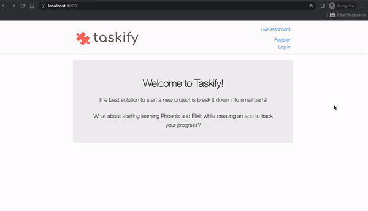

Taskify is a toy app created for the "Getting Started with Phoenix" workshop.
The goal is to introduce the basic structure of a [CRUD](https://en.wikipedia.org/wiki/Create,_read,_update_and_delete) web app using the [Phoenix Framework](https://phoenixframework.org/).

Estimated workshop duration: 2 hours

## Tracking tasks with Taskify

The best solution to start a new project is to break it down into small parts!
What about starting learning Phoenix and Elixir while creating an app to track your progress?

### Recommended setup

* Elixir 1.14.1
* Erlang  24.3.4.6
* Phoenix 1.6.15
* PostgreSQL 14.5

Suggestion: use [asdf](https://asdf-vm.com/guide/getting-started.html) with [elixir](https://github.com/asdf-vm/asdf-elixir) and [erlang](https://github.com/asdf-vm/asdf-erlang) plugins

### Task 001 - Creating your own taskify web app

* Run `mix phx.new taskify`
* Install dependencies with `mix deps.get`
* Create and migrate your database with `mix ecto.setup`
* Start Phoenix endpoint with `mix phx.server` or inside IEx with `iex -S mix phx.server`
* Now you can visit [`localhost:4000`](http://localhost:4000) from your browser.


### Task 002 - Building our landing page

The initial version of the new page will be available on:
<http://localhost:4000/welcome>

* Add new route: `/welcome`
* Add new controller: `WelcomeController`
* Add new view: `WelcomeView`
* Add new template: `welcome/index.html.heex`
* Updating `layout/root.html.heex`: Replacing logo image and link on the header page
* Updating page title

Now let's make our new landing page available on: <http://localhost:4000/>

* Set WelcomeControler#index as the root path

And finally, cleaning up dead code and warnings

* Remove dead code
* Fix gettext warning


### Task 003 - Adding an Authentication System

The [`mix phx.gen.auth`](https://hexdocs.pm/phoenix/mix_phx_gen_auth.html) command generates a flexible, pre-built authentication system into your Phoenix app.

To add it to your system, you can run the following command:

```bash
mix phx.gen.auth Accounts User users
```

In which:

* `Accounts` is the Phoenix context to wrap the `User` Module
* `User` is the Elixir module that will contain the Ecto schema for `users` table schema and other validations
* `users` is the name of database table to be created

It will generate a lot of files, including tests.
Continue to follow the instructions from the terminal.

Run he following command to re-fetch your dependencies:

```bash
mix deps.get
```

This command will fetch the new elixir dependency, added by the `mix phx.gen.auth` command. You will see a change on the `mix.lock` file.

Run the migrations, created for the authentication system:

```bash
mix ecto.migrate
```

Now your local database (`taskify_dev`) will have two new tables: `users` and `users_tokens`

```
19:08:39.931 [info] == Running 20221107215733 Taskify.Repo.Migrations.CreateUsersAuthTables.change/0 forward

19:08:39.934 [info] execute "CREATE EXTENSION IF NOT EXISTS citext"

19:08:39.983 [info] create table users

19:08:39.990 [info] create index users_email_index

19:08:39.991 [info] create table users_tokens

19:08:39.997 [info] create index users_tokens_user_id_index

19:08:39.998 [info] create index users_tokens_context_token_index

19:08:40.000 [info] == Migrated 20221107215733 in 0.0s
```

You can access the database with:

```
psql -d taskify_dev
```

Run `\dt` to see all tables in your database.

Now you have an authenticated system for your app 🎉



You can access the mailbox for development environment in: <http://localhost:4000/dev/mailbox>


Now your app knows when a user is logged or not!
Let's update our landing page to make the `Sign Up` flow more visible!

Update landing page to show `Sign Up` link along with the Welcome message.
Show the Sign Up message only for anonymous with assigns!

```elixir
<%= unless @current_user do %>
  <p><%= link "Sign Up", to: Routes.user_registration_path(@conn, :new) %></p>
<% end %>
```

More about `HEEx` (HTML + EEx) - Phoenix template language:
<https://hexdocs.pm/phoenix_live_view/assigns-eex.html>


Additional links about authentication, including sending emails:

* <https://www.literatelabs.com/p/how-to-get-verification-emails-for>
* <https://experimentingwithcode.com/phoenix-authentication-with-phx-gen-auth-part-1/>
* <https://experimentingwithcode.com/phoenix-authentication-with-phx-gen-auth-part-2/>
* <https://github.com/thoughtbot/bamboo>

## Troubleshooting

Compilation errors? Try to run:

```
mix deps.get --clean
```

Still having issues? Delete the `_build` folder to force the compilation

```
rm -rf _build
```

And then, run the server again:

```
mix deps.get
mix phx.server
```

Would you like to run your test suite?

```
mix test
```

Having issues with database used for test?

```
MIX_ENV=test mix ecto.reset
mix test
```
